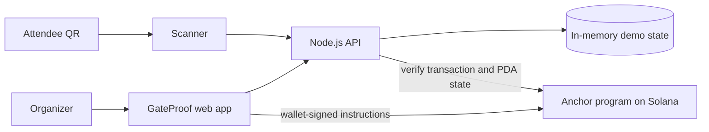

# GateProof

> Wallet-optional ticketing for independent event organizers, with verifiable ticket lifecycle state on Solana.

[Colosseum Kazakhstan Track](https://superteam.fun/earn/listing/colosseum-crypto-worlds-fair-hackathon-superteam-kazakhstan-track) · [Implementation Plan](IMPLEMENTATION_PLAN.md)

---

## Project Status

GateProof is a hackathon prototype. The local demo supports event creation, QR ticket issuance, transfer, revocation, and one-time check-in. The Anchor program and Devnet client flow are implemented in source, but the program has not yet been built or deployed.

The app currently runs in local demo mode. Events and tickets are stored in memory and reset when the server restarts. The hosted Vercel API also uses in-memory state, so its data is not durable or shared reliably across function instances.

---

## Problem and Solution

Small event teams need a lightweight way to issue tickets, replace a transferred ticket, revoke one, and prevent repeated entry scans. Attendees should be able to use a ticket without installing a wallet or understanding crypto.

GateProof gives organizers a simple event dashboard and QR scanner. Ticket secrets stay off-chain; Solana stores ticket state and a SHA-256 commitment that lets the server check the presented secret against the ticket PDA.

### Product Principles

- **No attendee wallet required:** attendees use a QR code; the organizer connects a Solana wallet for on-chain actions.
- **No attendee PII on-chain:** names, email addresses, and phone numbers are not part of the program state.
- **One-time entry:** a ticket can be checked in once; revoked or transferred QR secrets stop working.
- **Small first scope:** no ticket payments or marketplace in this prototype.

---

## Why Solana

GateProof uses an Anchor program to keep event capacity and ticket lifecycle transitions in program-owned accounts. Issuance, organizer-approved transfer, revocation, and check-in can be verified against the same on-chain state. The QR secret itself remains off-chain.

---

## Features

- Create events with a fixed ticket capacity.
- Issue QR tickets with random secrets.
- Transfer a ticket by rotating its QR secret and updating its on-chain commitment.
- Revoke tickets from the organizer dashboard.
- Scan QR codes with a compatible browser camera or enter the code manually.
- Reject repeated check-in attempts.
- Verify configured Devnet transactions, signers, PDA derivation, and resulting account state in the API.

---

## Architecture



The same UI and API support local demo mode before a program is deployed. In local mode, the API is the source of truth and all state is temporary. In Devnet mode, the API checks the transaction and account state after wallet signing.

---

## Tech Stack

| Layer | Technology |
| --- | --- |
| On-chain program | Rust · Anchor Framework |
| Wallet and Solana client | JavaScript · `@solana/web3.js` |
| Frontend | Vite · HTML · CSS · JavaScript |
| API | Node.js · HTTP · `qrcode` |
| Hosting target | Vercel static output and Node.js Function |
| Tests | Node.js test runner |

---

## Quick Start

Requires Node.js 20.19+ or 22.12+ and pnpm.

```sh
git clone https://github.com/zoxess/-.git gateproof
cd gateproof
pnpm install
pnpm dev
```

Open `http://localhost:4173` and create a demo event. The first QR scan is accepted; another scan of that ticket is rejected.

Run the API checks and production build:

```sh
pnpm test
pnpm build
```

---

## Solana Program

The program is in `programs/gateproof` and defines event and ticket PDAs. It supports:

- `create_event` — create an event with capacity.
- `issue_ticket` — issue a ticket with a holder commitment.
- `set_gate_authority` — configure who can check tickets in.
- `transfer_ticket` — replace the holder commitment.
- `revoke_ticket` — revoke an unused ticket.
- `check_in` — atomically mark a ticket as used.

The organizer is the initial gate authority. The current program ID in `Anchor.toml` and `lib.rs` is a development placeholder; replace and synchronize it before deployment. Rust, Solana CLI, and Anchor CLI are required to build the program.

---

## Vercel Deployment

`vercel.json` sets the build output directory to `dist`. The `/api/*` routes are handled by `api/[...path].mjs`.

The deployed API currently stores state in process memory. Vercel Functions can restart or run in separate instances, so use a persistent database before relying on event or ticket state across visitors or devices.

---

## Roadmap

- [x] Local event and ticket workflow.
- [x] QR issuance, transfer, revocation, and one-time check-in.
- [x] Anchor program source and wallet instruction wiring.
- [x] Vercel output and API routing configuration.
- [ ] Build and test the Anchor program with the official toolchain.
- [ ] Deploy the program to Devnet and verify wallet-backed flows.
- [ ] Add durable storage and organizer/scanner authentication.
- [ ] Capture and link a public demo video.

---

## Security and Scope

GateProof is a prototype, not production ticket infrastructure. It does not process payments. Before real events, add durable storage, authentication, rate limiting, QR expiry and rotation, key management, operational recovery, and a security review. Never place attendee names, email addresses, or phone numbers on-chain.
